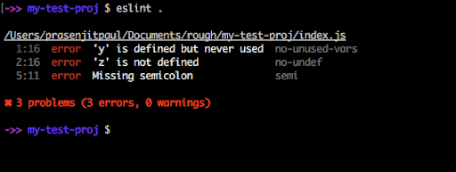

  Making code that works is not the only thing you have to worry about when programming. A lot goes into it, including making sure your code is up to par with others, be it legibility, conciseness, or just making it accessible to others reading it. Often in projects where code is being passed around by others, it is generally a good practice to use a unified coding style that everyone uses. This prevents issues that could come up from people having to decipher through various coding styles.
	
  For this class, we are using ESLint, a tool that helps us analyse our code to make sure it meets the class’ standards. One of the benefits of ESLint is that it can clean your code up by helping find errors that it can solve for you. ESLint on its’ comes with some basic coding style standards that you can implement in your projects such as if you are using indents, quotes for strings, etc.. This comes in handy when writing with a certain coding style that you have imported. When programming it is easy to get tunnel vision and your code can easily come out missing coding styles that are required. This is where ESLint comes in, as it will display the coding style errors for your code just like if there was an error preventing your code from compiling, example of this would be pointing out in a line that 4 indentations were expected while you may have put in two instead, or spaces instead of tabs. 
	
  Looking over some of the features of ESLint, I can definitely see how it will help me improve my code in the future. Often times I’ll skip around in a project writing different lines and adding in variables I don’t know if I’ll even end up using. Thankfully, ESLint has a feature where it will point out these redundancies. I think just like how after seeing the same error over and over in my projects I eventually formed the habit of preventing these errors occurring just by repetition from deleting the error and correcting it, I can foresee ESLint being similar in that I will continue to see the coding style error I used and after a while it will become second nature to write in the correct style.

