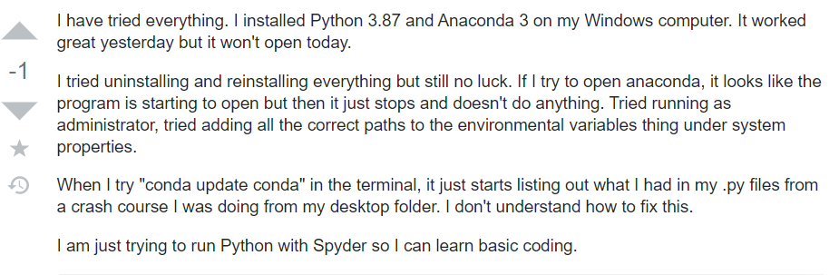
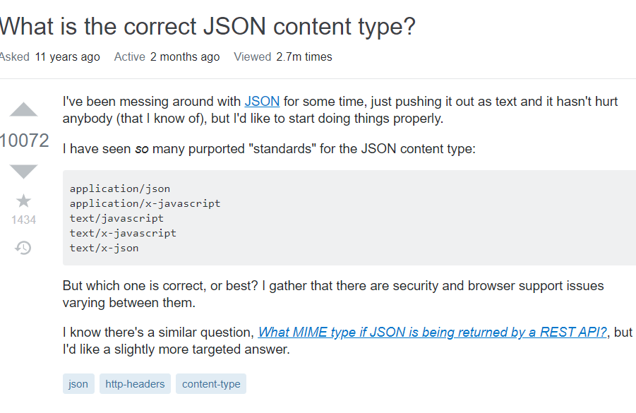

  The goal of a good question is to be able to inform who you are asking of your problem in a clear way so that the can understand your meaning clearly. Asking a good question will also make it more likely someone who is qualified to solve your problem will be willing to help you. A good question can easily stand out from the waves of bad ones. Making a smart question will include the problem being written in a concise way with no irrelevant info. You should also make it as easy as possible for the person who is helping you to reply. For this essay I am taking two examples of questions, one will be smart, one will be bad.
  

  For a bad example of a question, I chose this because it includes a variety of fluff and unneccessary info, such as saying why they are just trying to lean Python, they don't understand, and it worked yesterday. These bits of info don't help whover is trying to answer the question. The title is also excessive in saying that they have tried all solutions that exists, which is an unneccesary exagerration. The person asking also does not include any pictures other than the code he is trying to run. Providing pictures of his attempted solutions or even explaining what solutions he has tried besides two would be a much better help.
  
 
 
  For a smart question I have chosen this for a few reasons. The subject line tells us clearly what his question is without unneccessary info, such as "help", "I have a problem", etc., it lets us know immediatly what the problem is. In the question body the person gives us the file format he has been working with, JSON, even providing a Wikipedia link to make it as clear as possible. He also gives just enough info regarding his experience and what the scale of his problem might be. He points out that he has seen standards for JSON before and provides a picture of the ones he has seen, and provides further info he has on the matter. Another helpful part of the question is providing another similer question, but stating that he'd like a more targeted answer, which removes the possiblity of someone wasting time providing him with that answer.
