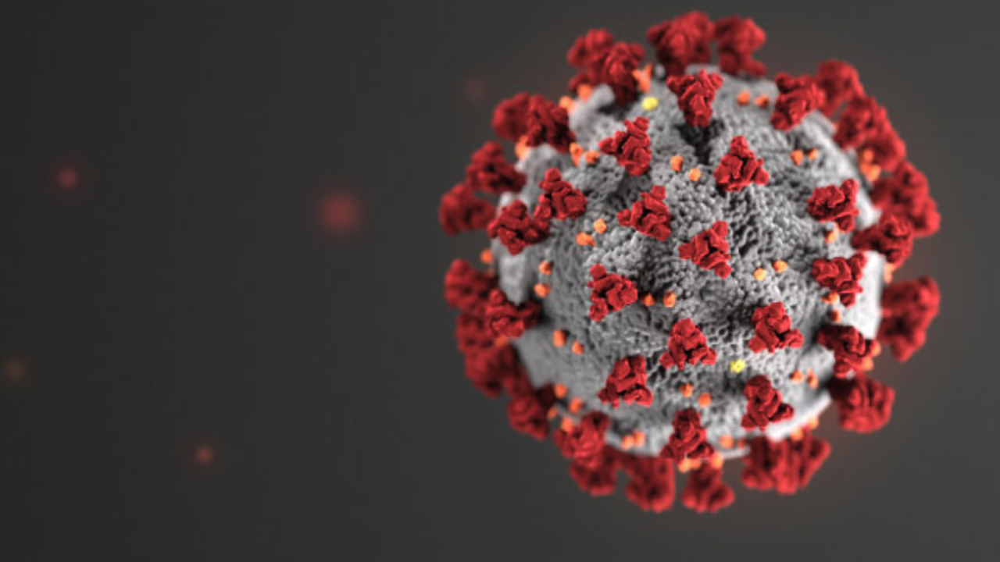

  

  Since March, COVID-19 has changed my life quite a bit, in ways involving day to day life and college. My day to day routine is quite different now with all classes being online, most of my planning on when to do assignments and when to learn material is almost entirely up to me now. This is manageable for the most part, but not having a strict schedule means I really have to motivate myself to get things done when they should be and making up that time not being in class with being productive, whether that be extra studying or something else. 

  Since classes are online, I went ahead and headed back to the mainland to go back home in California, so I have a little more obligations family-wise. Usually this just means picking up slack around the house and helping out. For the most part being back home is a pro and not a con.

  As far as ICS 314 goes, my routine is mostly unchanged since all assignments can be done on my own. Slack contributes a lot to easing this. Being able to post in what is essentially a group chat helps to get questions solved quick while still not being in person. The WOD’s not being in person is the most significant change, having them not be timed reduces a lot of stress, but also I feel I am learning a bit less, as the timed pressure forced me to learn quickly. Being able to show my teacher in person my problem and getting it solved right away is something that is missed from Covid. This was one of the most beneficial parts of in class teaching that is currently missed.

  As far as changes to move on successfully I think I am continuing on as well as I was before, but more studying on my own may be necessary to get a better grasp on what we are learning.
