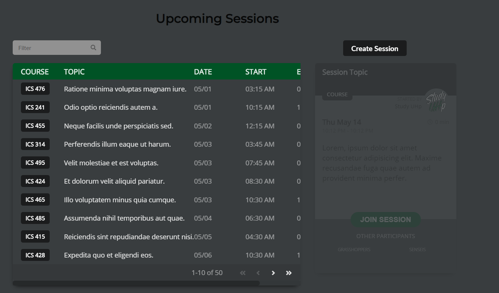
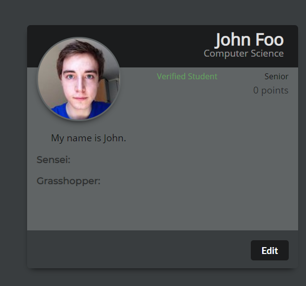

  For our final project we aimed to create a where for students to easily find people who could tutor them in computer science subjects. In addition we aimed to allow people to become tutors themselves. In the image below you can see the sessions page that allowed people to join sessions to be tutors along with the subjects, and with this the ability to create a new session.

  We also created a profile for users to join where they would be able to customize their profile. Future features were also planned such as messages and friends. Also a feature to allow points to be made by teaching others. This would create a renown system where you could know the validity of the tutors. This would work similar to rating an Uber driver.
  

